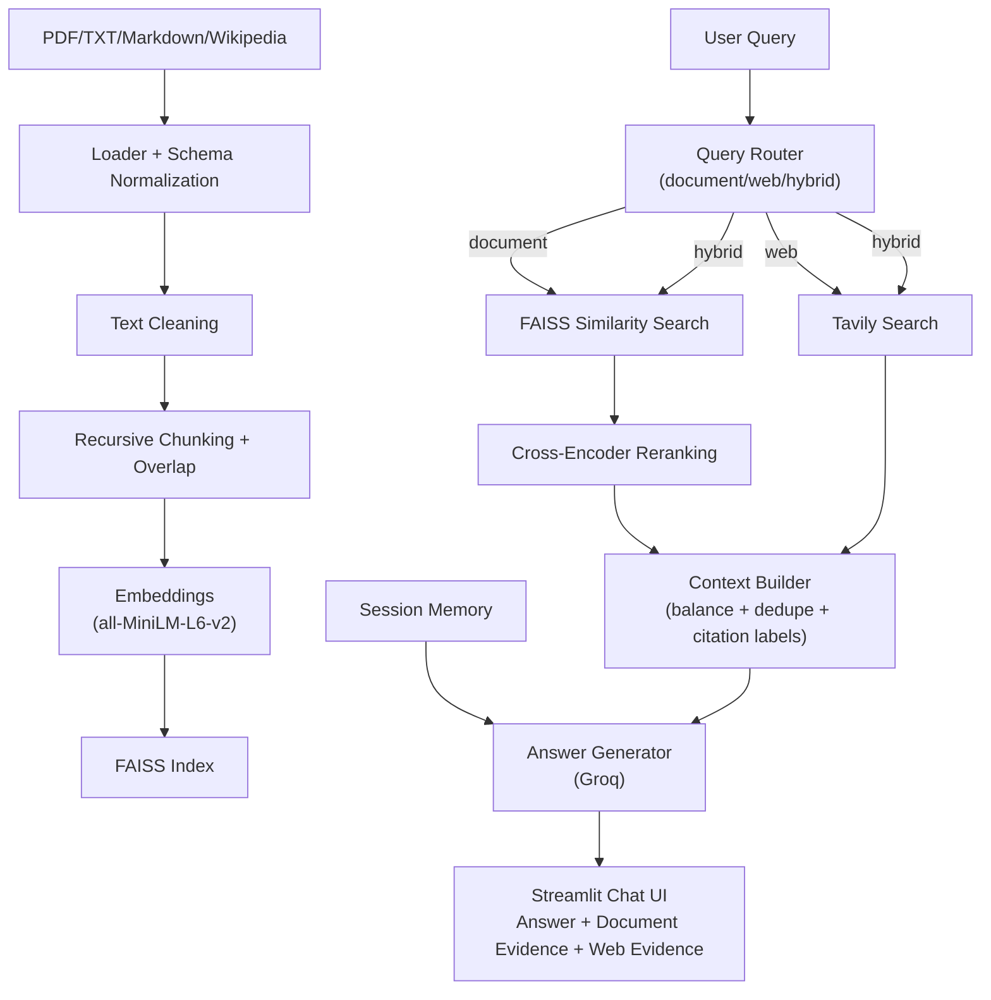

# Hybrid Multi-Document RAG Search Engine with Real-Time Web Search

A production-style hybrid Retrieval-Augmented Generation (RAG) application that answers user questions using both:

- Internal multi-document knowledge (PDF, TXT, Markdown, optional Wikipedia)
- Live web information through Tavily

It provides grounded answers, route transparency (`document` / `web` / `hybrid`), and source evidence in the Streamlit UI.

## Why This Project

Traditional document QA systems fail when a question needs current information.
This project solves that by combining:

1. Semantic retrieval from internal indexed documents
2. Real-time web retrieval
3. Citation-aware answer generation

## Key Features

- Multi-document ingestion with metadata normalization
- Text cleaning and recursive chunking with overlap
- FAISS semantic vector indexing
- Query routing: document, web, or hybrid
- Tavily web search integration
- Hybrid context balancing and deduping
- Groq-powered answer generation with streaming output
- Evidence transparency with separate Document and Web tabs
- Retrieval score visibility and reranking support

## End-to-End Architecture

### Flowchart



### Architecture Breakdown

- Ingestion layer loads and normalizes heterogeneous sources into a consistent document model.
- Processing layer cleans noisy text and chunks content into retrieval-friendly windows.
- Vector layer embeds chunks and persists them in FAISS for semantic search.
- Retrieval layer routes queries and combines internal retrieval with optional live web results.
- Context layer merges evidence, applies limits, and preserves source labels.
- Generation layer creates grounded responses with source-aware output.
- UI layer streams responses and exposes route/evidence transparency.

## Repository Structure

```text
hybrid-rag-search/
|-- app.py
|-- config.py
|-- requirements.txt
|-- README.md
|-- .gitignore
|-- ingestion/
|   |-- schema.py
|   |-- loaders.py
|   |-- cleaner.py
|-- indexing/
|   |-- chunking.py
|   |-- vector_store.py
|-- retrieval/
|   |-- semantic_search.py
|   |-- reranker.py
|   |-- query_router.py
|   |-- query_rewriter.py
|-- web/
|   |-- tavily_search.py
|-- rag/
|   |-- context_builder.py
|   |-- answer_generator.py
|   |-- citation_formatter.py
|   |-- memory.py
|   |-- summarizer.py
|-- ui/
|   |-- streamlit_ui.py
|   |-- style.css
|-- evaluation/
|   |-- test_queries.py
|   |-- evaluation_report.md
|-- docs/
|   |-- architecture.md
|   |-- design_decisions.md
|-- data/
|   |-- documents/
|       |-- sample_document.txt
|-- faiss_index/
|   |-- index_placeholder.txt
|   |-- source_manifest.json
```

## Setup

1. Create and activate a Python 3 environment.
2. Install dependencies:

```bash
pip install -r requirements.txt
```

## Required Secrets

Set these keys in Streamlit secrets:

- `GROQ_API_KEY`
- `TAVILY_API_KEY`

Example (`.streamlit/secrets.toml`):

```toml
GROQ_API_KEY = "your-groq-key"
TAVILY_API_KEY = "your-tavily-key"
```

## Run the App

```bash
streamlit run app.py
```

## UI Flow (What Users Experience)

1. Upload one or more documents (multi-PDF supported).
2. Optionally add Wikipedia topics.
3. Click `Index Sources` to build active index.
4. Ask question in chat.
5. System routes query (`document` / `web` / `hybrid`).
6. Response streams in real time.
7. User inspects evidence in tabs.

## Example Query Types

Document-centric:
- `What does the uploaded judgment say about personal liberty?`

Web-centric:
- `What are the latest updates in retrieval-augmented generation?`

Hybrid:
- `Compare this uploaded legal document with recent web commentary.`

## Deployment (Streamlit Community Cloud)

1. Push repository to GitHub.
2. Create a new Streamlit app.
3. Select entrypoint `app.py`.
4. Add `GROQ_API_KEY` and `TAVILY_API_KEY` in app secrets.
5. Deploy and index sources from sidebar.

## Evaluation Artifacts

- `evaluation/test_queries.py`: scenario query set
- `evaluation/evaluation_report.md`: strengths, limitations, future improvements

## Notes

- `faiss_index/` stores local vector index artifacts.
- Active source state is persisted via `source_manifest.json`.
- Web results are temporary retrieval context and are not written into FAISS.

## Roadmap

- Add automated retrieval/grounding metrics
- Add stricter citation validation
- Add hybrid sparse+dense retrieval
- Add persistent user sessions and exports
