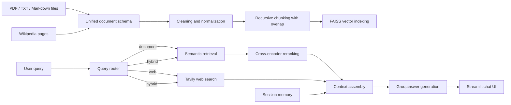

# Architecture

## Goal

Build a hybrid RAG search system that answers user questions with a blend of internal document evidence and live web search results, while keeping sources explicit and easy to inspect.

## System diagram

## Hybrid RAG pipeline

1. Local files and Wikipedia pages are normalized into a shared schema so every source carries `source_id`, `source_type`, `title`, `content`, and `metadata`.
2. Cleaning removes whitespace noise, broken newlines, and extraction artifacts before embeddings are created.
3. Recursive chunking splits long documents into overlapping windows for better semantic recall.
4. FAISS stores embeddings from `sentence-transformers/all-MiniLM-L6-v2` and persists the index in `faiss_index/`.
5. Query routing classifies each request as `document`, `web`, or `hybrid`.
6. Query rewriting expands short or vague prompts before retrieval.
7. Semantic retrieval returns top chunks and keeps retrieval scores in metadata.
8. Cross-encoder reranking improves the chunk order before context assembly.
9. Tavily search adds live web evidence when the route needs current information.
10. Context assembly balances internal chunks and Tavily snippets under a fixed size budget.
11. Groq generates the final answer from the assembled context and the current chat memory.

## Document retrieval flow

- `ingestion/loaders.py` loads PDFs, text-like files, and Wikipedia pages.
- `ingestion/schema.py` defines shared models for full documents, chunks, web results, and answer sources.
- `indexing/chunking.py` adds chunk metadata such as document title, chunk index, and source type.
- `indexing/vector_store.py` builds and reloads the persisted FAISS index.
- `retrieval/semantic_search.py` performs similarity search and surfaces FAISS scores.
- `retrieval/reranker.py` uses `cross-encoder/ms-marco-MiniLM-L-6-v2` to keep the strongest evidence near the top.

## Web search integration

- `web/tavily_search.py` retrieves live search results through Tavily.
- Web results are treated as temporary documents and never persisted into FAISS.
- The UI keeps document evidence and web evidence on separate tabs so users can tell which facts came from which retrieval path.

## Context assembly

- `rag/context_builder.py` formats document and web evidence into citation-ready context blocks.
- Hybrid mode uses a balanced mix of up to 3 internal chunks and 2 Tavily results.
- Context size is capped before answer generation so the final prompt remains stable on deployment targets.

## Transparency features

- The chat UI shows the selected query route with document, web, or hybrid indicators.
- Document evidence exposes document title, chunk index, FAISS score, and rerank score.
- Top-document summaries provide a quick read of the strongest internal evidence before the full chunk list.
